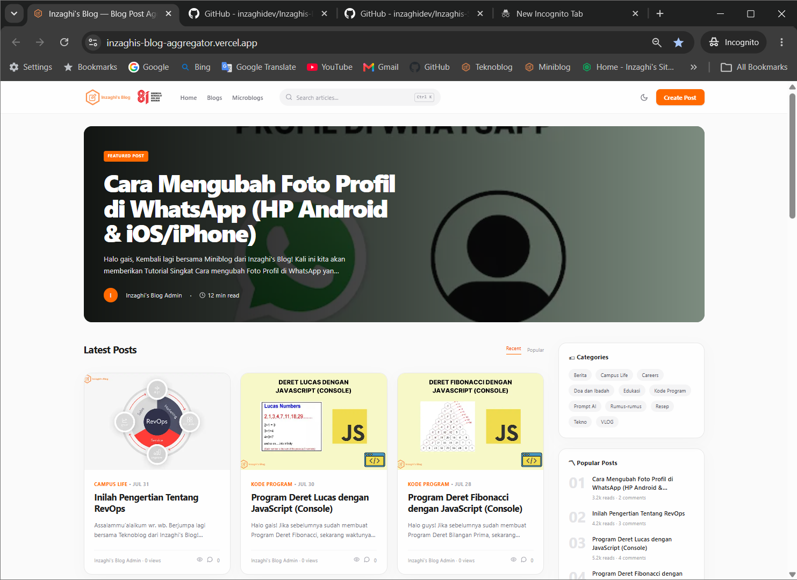
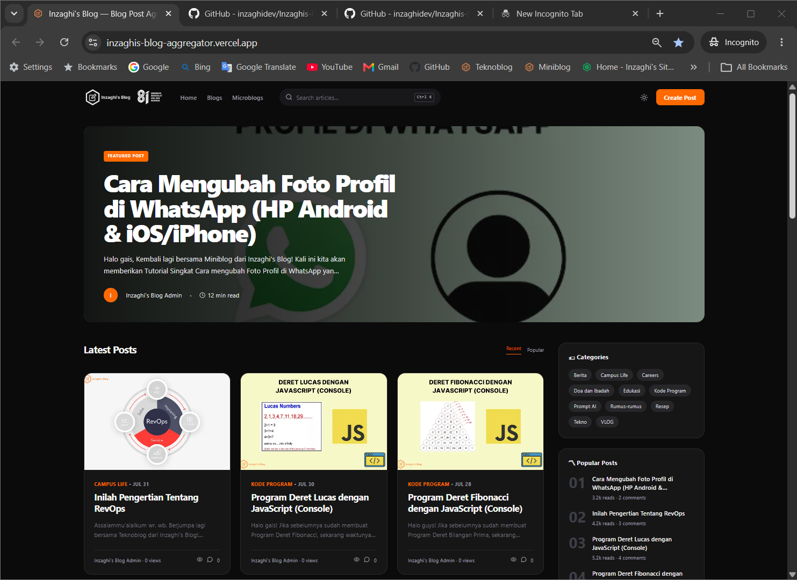

# Inzaghi's Blog Aggregator

A premium multi-blog developer publication built with Next.js 15, React 19, TypeScript, Tailwind CSS 4, and the Google Blogger API v3. The app presents Blogger blogs through a secure server-side proxy—API credentials never reach the browser.

## Inzaghi's Blog Aggregator Homepage

Light Mode :

Dark Mode :

## Included

- Responsive editorial home, story feed, category and author pages
- Dynamic post pages with JSON-LD, OpenGraph metadata, related stories, table of contents shell, sharing, syntax-friendly content, and comments UI
- Blogger aggregation for IB Legacy, Teknoblog, and Miniblog
- Server-only API layer, HTML sanitization, ISR caching, image optimization, and IP rate limiting
- `robots.txt`, dynamic `sitemap.xml`, and `/rss.xml`
- Dark mode, motion-ready card transitions, loading and error states

## Run locally

1. Copy `.env.example` to `.env.local`.
2. Set `BLOGGER_API_KEY` and comma-separated `BLOGGER_BLOG_IDS` (in the order Legacy, Teknoblog, Miniblog).
3. Run `npm install`, then `npm run dev`.

Without credentials, the site deliberately runs with polished demo content so the interface can be reviewed safely.

## Blogger / Google Cloud setup

1. In Google Cloud Console, create or select a project and enable **Blogger API v3**.
2. Create an API key, restrict it to the Blogger API, and apply HTTP referrer restrictions where appropriate.
3. Find each blog's ID using the Blogger dashboard or `GET /blogs/byurl?url=...`; add IDs to `BLOGGER_BLOG_IDS`.
4. Keep `.env.local` private. The only server code that reads the key is `lib/blogger/service.ts`.

Read operations use `/blogs/{blogId}`, `/posts`, and `/posts/{postId}`. Future publishing should use Google OAuth 2.0 with a server-side authorization-code callback and encrypted token storage; do not use an API key for write operations.

## Deploy to Vercel

Import the repository in Vercel, add the three variables from `.env.example`, and deploy. Set `NEXT_PUBLIC_SITE_URL` to the final HTTPS origin. Vercel automatically serves ISR revalidation, sitemap, robots, RSS, and optimized remote images.

## Architecture

`app/` contains App Router routes and SEO endpoints; `components/` contains reusable UI; `lib/blogger/` contains the isolated data domain. The public `/api/articles` route is a cached, rate-limited façade for client enhancements such as instant search/infinite scrolling. Add authenticated admin Route Handlers and an OAuth token repository without changing presentation components.
